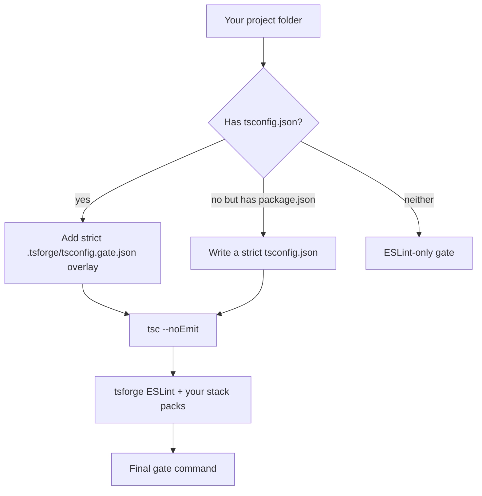

When you start tsforge on a project, it needs an answer to one question: **how do we know the work is actually done?**

That answer is the **gate**: a shell command that must exit with code 0. If it fails, the model gets the errors and tries again. If it passes, tsforge treats the task as complete.

This page explains how tsforge **chooses** that command when you do not set one yourself.

## The gate in practice

Example gate for a typical TypeScript repo with tests:

```bash
tsc --noEmit -p .tsforge/tsconfig.gate.json && eslint --max-warnings 0 … && bun test
```

You do not have to memorize this. tsforge builds something like it automatically.

You can override anytime:

| You type | Effect |
| --- | --- |
| `/gate bun test` | use your command for the rest of the session |
| `tsforge "task" --accept "bun test"` | one-shot run with a custom gate |
| `--strict-floor-only` | strict tsc + ESLint only. Do **not** append the project's tests |
| `--no-gate` | skip auto-detection (advanced) |

See [When the gate fails](/loop/validation/) for what happens when the gate fails and how the repair loop stops.

## No code, no gate (yet)

The automatic gate is a strict TypeScript gate, so it only makes sense once there is something to check. In a folder with **no JS/TS project**, such as research notes or an empty directory, the auto gate stays **dormant**. "No project" means no `package.json`, no `tsconfig`, and no `.ts`/`.js` source outside `notes/`, `node_modules/`, `dist/` and similar folders. While the gate is dormant:

- the session works as an assistant: no "drive to a green gate" prompt, no `check` or `pull_conventions` tools, and no gate runs after a turn
- reading and browsing count as progress, so a long research session isn't told to "stop reading"
- `task_complete` records checklist items without a gate check

The first time code appears in the folder (the model creates `src/index.ts`, or a scaffold finishes), the gate **wakes up**. It stays on for the rest of the session with the full build behaviour. `/config` shows the gate as "dormant until the folder has code" until then. An explicit gate (`/gate …`, `--accept`) is never dormant.

If nothing matches `.` at all, the ESLint stage passes rather than failing with "all files are ignored".

## What tsforge looks at first



Three common cases:

**Existing TypeScript repo** (you already have `tsconfig.json`). tsforge writes an ephemeral overlay at `.tsforge/tsconfig.gate.json` that extends yours and turns on strict flags tsforge cares about (`strict`, `noUncheckedIndexedAccess`, and similar). Your original file stays untouched.

**New project with `package.json` but no tsconfig yet**. tsforge writes a full strict `tsconfig.json` so the model cannot slip through on loose settings. Unlike the overlay, this is a real, durable project file.

**Not really a TypeScript project**. No `tsc` step. The gate is ESLint-only.

### Where the overlay lives

The strict overlay is a **cache artifact, not a project file**: it lives under `.tsforge/` (tsforge's own folder, alongside `.tsforge/rules.json`), never as a `tsforge.tsconfig.json` in your repo root. tsforge also drops a scoped `.tsforge/.gitignore` so the overlay stays out of git. It's created only if you do not already have one, so a `.tsforge/.gitignore` you wrote (e.g. to track `rules.json`) is never overwritten.

## TypeScript check (`tsc`)

`tsc --noEmit` means "typecheck everything, do not emit JavaScript files."

tsforge does **not** trust a loose upstream tsconfig. Even if your repo allows sloppy settings, the gate uses tsforge's strict overlay. That is intentional: the harness is opinionated about merge-ready TypeScript.

## ESLint check

After typecheck, tsforge runs **its own** ESLint setup. It does **not** run your project's `npm run lint` script.

Why separate? tsforge ships rules tuned for AI-written code and your stack (React, Drizzle, Elysia, Three.js, etc.). Those rules come from [Rule packs](/guardrails/rule-packs/) enabled by [Stack detection](/guardrails/stack-detection/). Tune them with a [profile](/guardrails/config/#profiles) or per-rule overrides in [tsforge.config.json](/guardrails/config/).

The core ESLint config is **syntactic-only** (no type-aware rules) so it runs on any `.ts` file without the target's full type graph. It also caps **cognitive complexity at 20** and **nesting depth at 4**. A sprawling, deeply-nested function fails the gate until it is split into named helpers.

On the **strict** [profile](/guardrails/config/#profiles) (any project with a `tsconfig.json`), tsforge adds a **type-aware pass** that catches what `tsc --strict` and the syntactic rules can't:

- **Async correctness**: `no-floating-promises`, `no-misused-promises`. A dropped `await` is a gate error.
- **Implicit-`any` containment**: the `no-unsafe-*` family. `no-explicit-any` bans the literal `any` token, but it cannot see `any` that leaks in from an untyped boundary (`JSON.parse`, `await res.json()`, an untyped dependency), which `tsc` propagates silently. These rules force you to validate the boundary, then the data is typed.

The default `recommended` profile keeps the gate syntactic-only for speed, since type-aware rules can be noisy on existing code. Set `"profile": "strict"` in [tsforge.config.json](/guardrails/config/) to turn the pass on. Web-app gates run it regardless of profile.

Baseline stylistic rules (all stacks) include blank lines before `return` and around block-like statements via `@stylistic/padding-line-between-statements`. That rule is **auto-fixed by `eslint --fix`**, not Prettier. Prettier does not enforce semantic blank lines. Non-web sessions run the same eslint + prettier janitor (`buildCoreFix`) before the gate, so the blank line is inserted without model turns.

## Your tests run too

Type-check and lint prove the code is well-formed; your **tests** prove it's correct. So the auto-gate runs them as well. "Green" means the strict floor **and** your tests pass.

tsforge finds the test command automatically:

- a real `test` script in `package.json` → `bun run test`
- otherwise, if the project has `*.test.ts` / `*.spec.ts` files → `bun test`
- neither (a greenfield app with no tests yet) → nothing is appended; the gate stays at the strict floor

The npm-init placeholder (`"echo \"Error: no test specified\" && exit 1"`) is ignored. It never counts as "has tests." Tests run **last**, after the cheap static checks, so a type or lint error fails fast without waiting on a test run.

Opt out with **`--strict-floor-only`** when you want the type/lint floor without running tests every cycle (e.g. a slow suite). An explicit `--accept` gate always wins.

### Opt-in oracles: coverage and boot

Two extra gate steps prove the work is real, not just well-formed. Both default **off** and skip cleanly when there's nothing to check:

| Env var | Adds |
| --- | --- |
| `TSFORGE_COVERAGE=<pct>` | runs the suite with coverage and fails if the **weaker of line/function coverage** is below `<pct>`. A green suite that never calls the new code no longer passes |
| `TSFORGE_BOOT="<start cmd>"` | actually **boots the server** (`TSFORGE_BOOT_URL`, default `http://localhost:3000/`) and fails unless it answers without a 5xx. Catches boot-time crashes that type-check and lint clean |
| `TSFORGE_PROPTEST=1` | **property-fuzzes** every exported function: derives `fast-check` inputs from its TypeScript parameter types and fails if it throws on any valid input. Catches edge-case crashes (empty array, NaN, out-of-range) that example tests miss. Best for pure functions. |

Coverage checks **function** coverage as well as lines, so a one-line export that's never exercised can't hide behind a "line executed at declaration" count.

## Full-stack (BoringStack) builds use the project's own gate

A web app built via [`tsforge scaffold`](/scaffold/boringstack/) doesn't get a
tsforge-invented gate. Instead, "done" is **BoringStack's own** composed gate, run exactly as
a developer runs it:

```
(cd apps/api && bun run validate) && (cd apps/ui && bun run validate) && bun run check
```

Two things make this honest rather than brittle in the [greenfield loop](/loop/greenfield/):

- **Auto-fix before the gate.** After the model writes, the harness runs the project's
  own `bun run format` (prettier) then `bun run lint:fix` (eslint `--fix`) over both
  apps. Those classes are deterministic and 100% auto-fixable, so they never cost the
  model a gate attempt. A developer gets them on save; the model should too. Only
  genuine, non-auto-fixable violations reach the gate as feedback.
- **Baseline-aware differential gate.** The gate is captured once on the *pristine*
  scaffold before any model work. A feature then passes when it introduces **no new
  failures**. A pre-existing base-suite/scaffold defect the model is frozen out of
  can never wedge the build, and the model's feedback shows only the failures *it*
  caused. A red baseline is surfaced loudly (the scaffold itself should be fixed); it
  is not silently tolerated. This is not a gate relaxation. The full gate still runs
  on everything the model touches or newly breaks.

## Two kinds of checking

Do not confuse these:

**Session gate** (this page). Runs when tsforge decides whether a task is finished. One command, exit 0 or not.

**Write-time feedback** (faster, per edit). After each `edit` or `create`, tsforge can show type errors on that file immediately, before the full gate runs. See [Write diagnostics](/uplift/write-diagnostics/) and [TypeScript language server](/lsp/typescript-server/).

Write-time feedback helps the model fix mistakes early. The session gate is still the final word.

→ [Big picture](/big-picture/) · [When the gate fails](/loop/validation/) · [Interactive CLI](/cli/interactive/)
